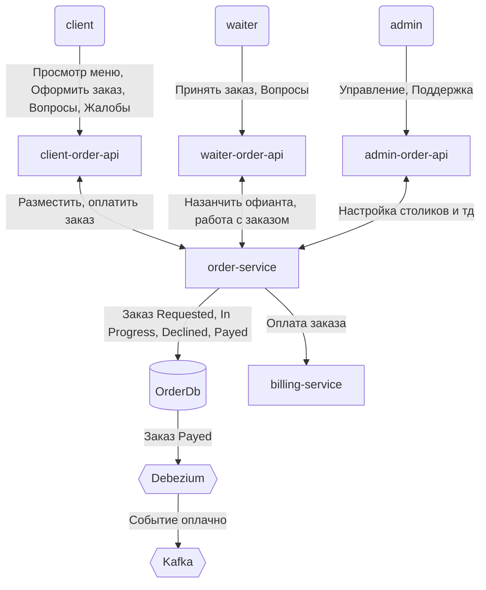

| Дано                      | предположения                                                | Нагрузка |
|---------------------------|--------------------------------------------------------------|----------|
| 20 000 заказов            | время с 12 до 16 и с 18 до 23 в будни, c 12 до 02 в выходные |          |
| 10 официантов на ресторан | Средний заказ 40 минут, 1 официант - 7 заказов               |          |
| 100 рестаранов            | 1000 официантов, 100 администраторов, 2 бухгалтера           |          |

    RestaurantDb[(RestaurantDb)]
    restaraunt-service