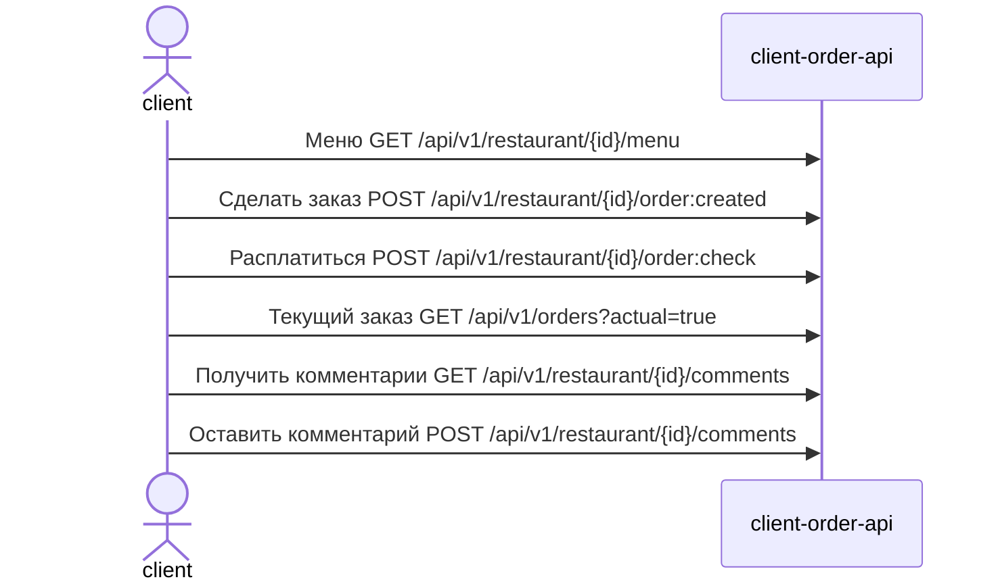
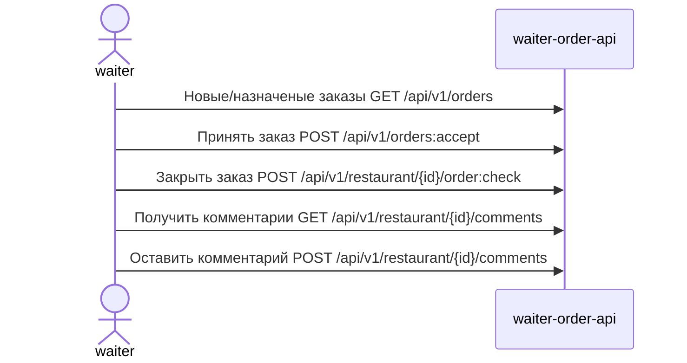
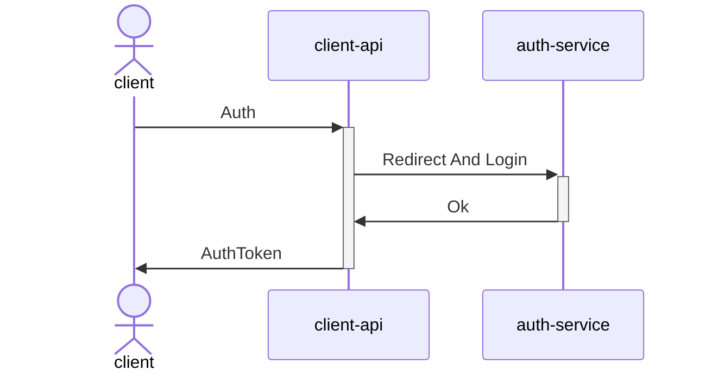

```mermaid
sequenceDiagram
    actor client
    client ->> client-order-api: Меню  GET /api/v1/restaurant/{id}/menu
    client ->> client-order-api: Сделать заказ  POST /api/v1/restaurant/{id}/order:created
    client ->> client-order-api: Расплатиться POST /api/v1/restaurant/{id}/order:check
    client ->> client-order-api: Текущий заказ  GET /api/v1/orders?actual=true
    client ->> client-order-api: Получить комментарии  GET /api/v1/restaurant/{id}/comments
    client ->> client-order-api: Оставить комментарий  POST /api/v1/restaurant/{id}/comments
```
 

```mermaid
sequenceDiagram
    actor waiter
    waiter ->> waiter-order-api: Новые/назначеные заказы GET /api/v1/orders
    waiter ->> waiter-order-api: Принять заказ POST /api/v1/orders:accept
    waiter ->> waiter-order-api: Закрыть заказ POST /api/v1/restaurant/{id}/order:check
    waiter ->> waiter-order-api: Получить комментарии  GET /api/v1/restaurant/{id}/comments
    waiter ->> waiter-order-api: Оставить комментарий  POST /api/v1/restaurant/{id}/comments

```

```mermaid
sequenceDiagram
    actor client
    client ->>+ client-api: Auth
    client-api ->>+ auth-service: Redirect And Login
    auth-service ->>- client-api: Ok
    client-api ->>- client: AuthToken
```