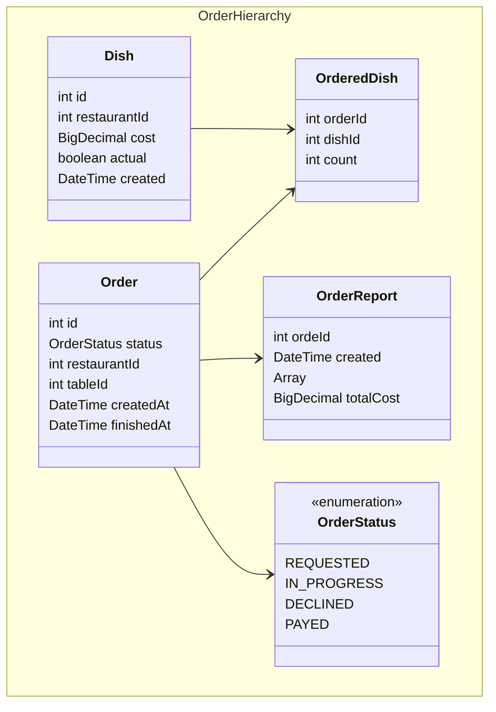

```mermaid
classDiagram
    namespace OrderHierarchy {
        class Order {
            int id
            OrderStatus status
            int restaurantId
            int tableId
            DateTime createdAt
            DateTime finishedAt
        }
        class OrderedDish {
            int orderId
            int dishId
            int count
        }
        class Dish {
            int id
            int restaurantId
            BigDecimal cost
            boolean actual
            DateTime created
        }
        class OrderStatus{
            <<enumeration>>
            REQUESTED
            IN_PROGRESS
            DECLINED
            PAYED
        }
        class OrderReport {
            int ordeId
            DateTime created
            Array
            BigDecimal totalCost
        }
    }

    Order --> OrderedDish
    Dish  -->  OrderedDish
    Order  -->  OrderReport
    Order  -->  OrderStatus
    
    
```
namespace PersonalHierarchy{

}

