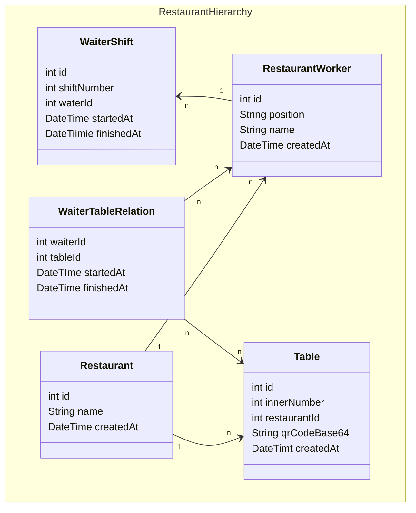
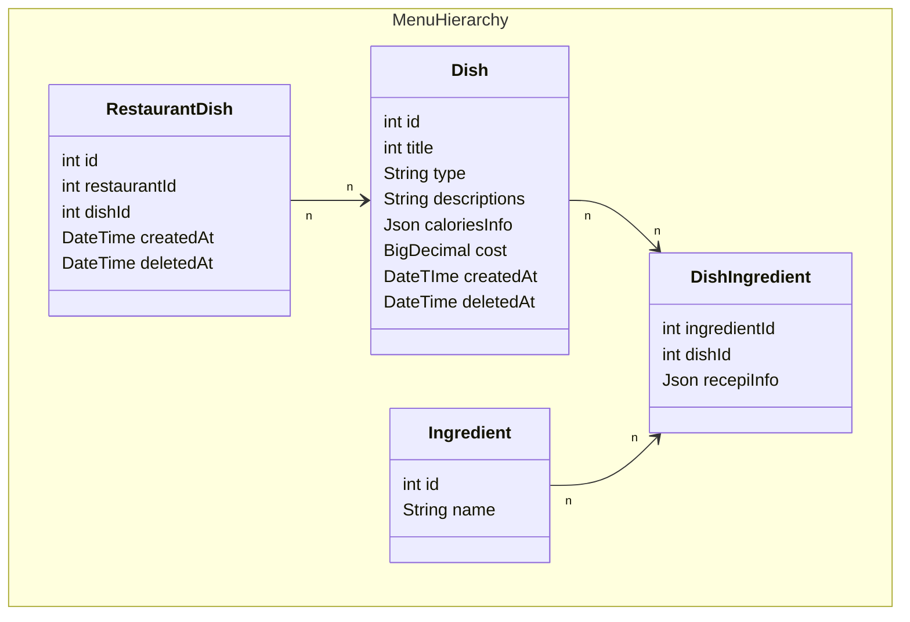

```mermaid
classDiagram
    namespace OrderHierarchy {
        class Order {
            int id
            OrderStatus status
            int restaurantId
            int tableId
            DateTime startedAt
            DateTime finishedAt
        }
        class OrderedDish {
            int orderId
            int dishId
            int count
        }
        class Dish {
            int id
            int restaurantId
            BigDecimal cost
            boolean actual
            DateTime createdAt
        }
        class OrderStatus {
            <<enumeration>>
            REQUESTED
            IN_PROGRESS
            DECLINED
            PAYED
        }
        class OrderReport {
            int ordeId
            DateTime createdAt
            Array
            BigDecimal totalCost
        }
    }

    Order "n" --> "n" OrderedDish
    Dish "n" --> "n" OrderedDish
    Order "n" --> "n" OrderReport
    Order "1"--> "1" OrderStatus
```    

```mermaid
classDiagram
    namespace RestaurantHierarchy {
        class Restaurant {
            int id
            String name
            DateTime createdAt
        }

        class Table {
            int id
            int innerNumber
            int restaurantId
            String qrCodeBase64
            DateTimt createdAt
        }

        class WaiterTableRelation {
            int waiterId
            int tableId
            DateTIme startedAt
            DateTime finishedAt
        }

        class WaiterShift {
            int id
            int shiftNumber
            int waterId
            DateTime startedAt
            DateTiimie finishedAt
        }

        class RestaurantWorker {
            int id
            String position
            String name
            DateTime createdAt
        }
    }

    Restaurant "1" --> "n" RestaurantWorker
    Restaurant "1" --> "n" Table
    WaiterTableRelation "n" --> "n" Table
    WaiterTableRelation "n" --> "n" RestaurantWorker
    WaiterShift "n" <-- "1" RestaurantWorker


```

```mermaid
classDiagram 
    namespace MenuHierarchy {

        class RestaurantDish {
            int id
            int restaurantId
            int dishId 
            DateTime createdAt
            DateTime deletedAt
        }

        class Dish {
            int id
            int title
            String type
            String descriptions
            Json caloriesInfo
            BigDecimal cost
            DateTIme createdAt
            DateTime deletedAt
        }

        class Ingredient {
            int id
            String name
        }

        class DishIngredient {
            int ingredientId
            int dishId
            Json recepiInfo
        }
    }    
    
    RestaurantDish "n" --> "n" Dish
    Dish "n" --> "n" DishIngredient
    Ingredient "n" --> "n" DishIngredient
```

