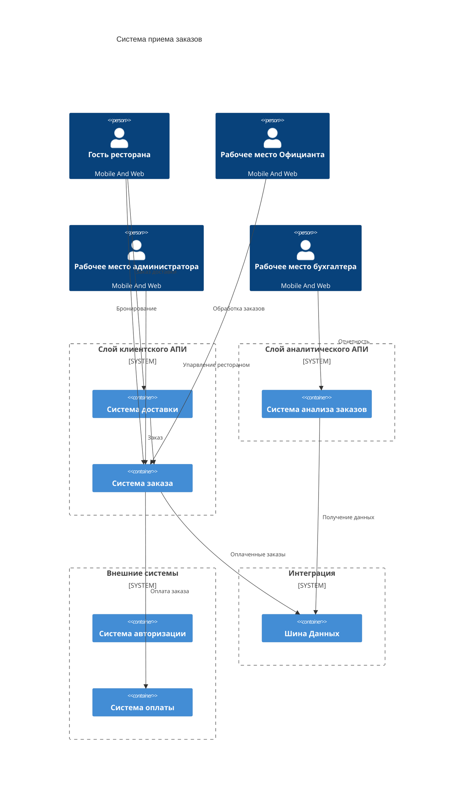

```mermaid
  C4Context
    title Система приема заказов
    Person(client, "Гость ресторана", "Mobile And Web")
    Person(waiter, "Рабочее место Официанта", "Mobile And Web")
    Person(admin, "Рабочее место администратора", "Mobile And Web")
    Person(accountant, "Рабочее место бухгалтера ", "Mobile And Web")

    System_Boundary(front, "Слой клиентского АПИ") {
        Container(deliveri-service, "Система доставки")
        Container(order-service, "Система заказа")
    }
    System_Boundary(back, "Слой аналитического АПИ") {
        Container(analytics-service, "Система анализа заказов")
    }
    System_Boundary(outsource, "Внешние  системы") {
        Container(auth-service, "Система авторизации")
        Container(billing-service, "Система оплаты")
    }
    System_Boundary(data, "Интеграция") {
        Container(service-bus, "Шина Данных")
    }

    Rel(client, deliveri-service, "Заказ доставки")
    UpdateRelStyle(client, deliveri-service, $offsetY="-30")
    Rel(client, order-service, "Бронирование")
    UpdateRelStyle(client, order-service, $offsetY="-30", $offsetX="-40")
    Rel(waiter, order-service, "Обработка заказов")
    UpdateRelStyle(waiter, order-service, $offsetY="-30", $offsetX="10")
    Rel(admin, order-service, "Упарвление рестораном")
    UpdateRelStyle(admin, order-service, $offsetY="-30", $offsetX="80")
    Rel(accountant, analytics-service, "Отчетность")
    UpdateRelStyle(accountant, analytics-service, $offsetX="40")
    
    Rel(deliveri-service, order-service, "Заказ")
    Rel(order-service, billing-service, "Оплата заказа")
    UpdateRelStyle(order-service, billing-service, $offsetX="10")
    Rel(order-service, service-bus, "Оплаченные заказы")
    Rel(analytics-service, service-bus, "Получение данных")
    UpdateRelStyle(analytics-service, service-bus, $offsetX="10")
    
    UpdateRelStyle(deliveri-service, order-service, $offsetY="-10", $offsetX="-10")
    UpdateLayoutConfig($c4ShapeInRow="4", $c4BoundaryInRow="2")


```