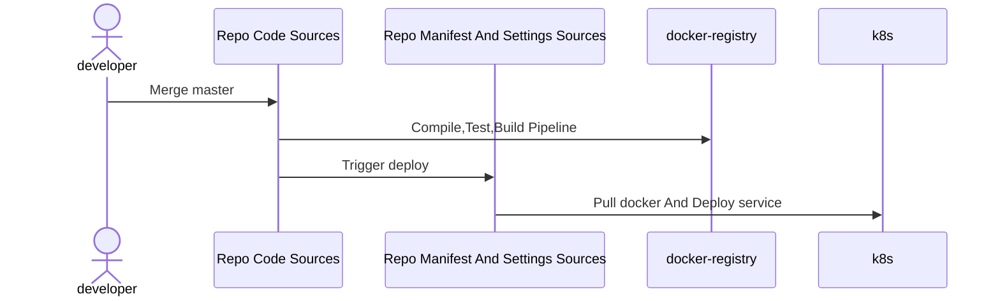

Каждый сервис со своей БД может разрабатываться отдельной командой. Архитектор следит завыполнением

```mermaid
sequenceDiagram
    actor developer
    participant gitlab as Repo Code Sources
    participant deploy as Repo Manifest And Settings Sources
    
    developer ->> gitlab: Merge master
    gitlab ->> docker-registry: Compile,Test,Build Pipeline
    gitlab ->> deploy: Trigger deploy 
    deploy ->> k8s: Pull docker And Deploy service
```
 